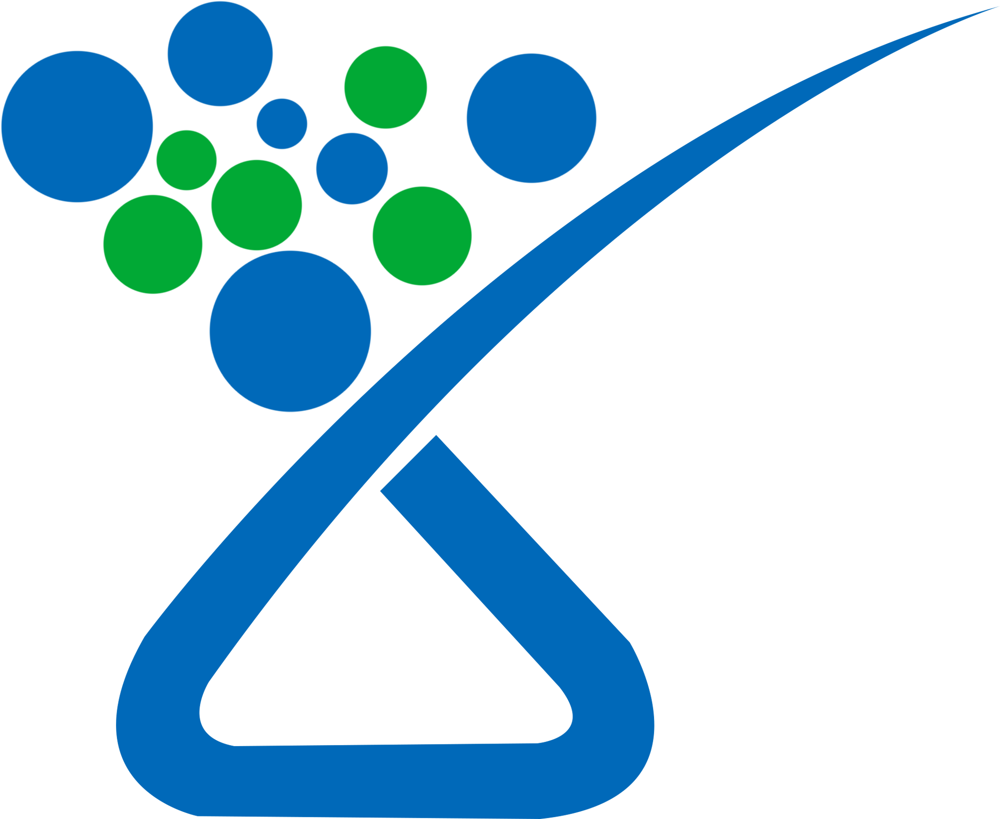

# 🧪 Xd Lab

A modern, responsive laboratory website built with [Next.js](https://nextjs.org/). This project showcases lab services, research highlights, team members, and contact information in a clean and professional layout.

## 🚀 Features

- ⚡ Built with Next.js for fast performance and SEO optimization
- 🎨 Responsive design using CSS
- 🧬 Dynamic pages for lab services, research projects, and team profiles
- 📬 Contact form integration.
- 🔒 Secure and accessible design

## 📁 Project Structure

```bash
├── components/        # Reusable UI components
├── pages/             # Next.js pages (routes)
│   ├── index.jsx      # Home page
│   ├── about.jsx      # About the lab
│   ├── services.jsx   # Lab services
│   ├── research.jsx   # Research projects
│   ├── team.jsx       # Team members
│   └── contact.jsx    # Contact form
├── public/            # Static assets
├── styles/            # Global styles
└── next.config.js     # Next.js configuration
```

 ## 🛠️ Technologies Used


- Next.js

- React

- CSS for styling

- Vercel for deployment


#### Clone the repository
git clone https://github.com/OmarYasirR/xd_lab.git

```bash
cd xd_lab
```

#### Install dependencies
```bash
npm install
```

#### Run the development server
```bash
npm run dev
```

## 🤝  Contributing

Contributions are welcome! If you'd like to improve the site, fix bugs, or add features:

Fork the repository

Create a new branch (git checkout -b feature-name)

Commit your changes

Push to your fork and open a pull request

## 📄 License
This project is licensed under the MIT License.

Made with ❤️ using Next.js
